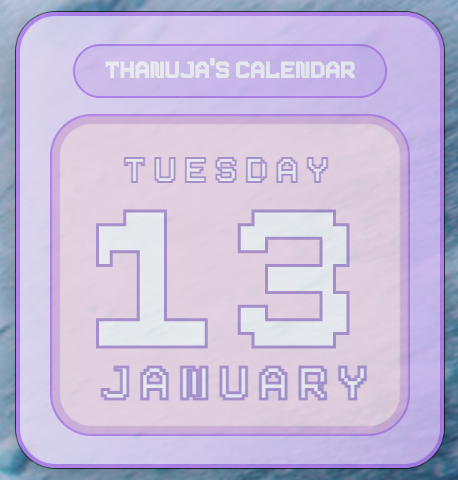

#  Electron Calendar Widget

My first Electron desktop app  
A pixel-style floating calendar widget built using **Electron, HTML, CSS, and JavaScript**.

This app displays the **weekday, date, and month** in a minimal frameless desktop window.

---

## 📸 Preview



---

## ✨ Features

- 📅 Displays **weekday, date, and month**
- 🪟 Frameless desktop widget
- 🎨 Pixel-style UI design
- 🖱️ Draggable window
- 📴 Works completely offline
- 🍎 macOS desktop app (DMG)

---

## 🛠️ Tech Stack

- **Electron**
- **HTML**
- **CSS**
- **JavaScript**

---

## 🚀 Run Locally (Development)

```bash
npm install
npm start
📦 Build Desktop App
bash
Copy code
npm run build
This generates a macOS .dmg installer inside the dist/ folder.

🖥️ Platform Support
macOS ✅
